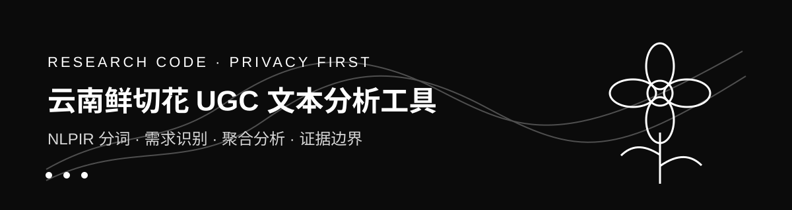

# NLPIR 文本分析与图表输出工具



**这是一个面向农业数字经济研究的隐私保护型代码展示仓库。** 它提供可复用的 Python 工作流：数据字段校验、NLPIR 分词与关键词提取、词频统计、分类汇总和 SVG 图表输出。鲜切花 UGC 研究是该工作流的应用示例；仓库不公开平台用户原文、账号信息、完整分词结果或未发表论文材料。

**它不是 NLPIR 官方完整发行版，也不是无条件适用于所有文本的“一键分析器”。** 任何使用者都可以参考这套 Python 代码处理自己的已获授权中文文本，但应按自己的研究问题准备字段、安装 PyNLPIR 并自行确认底层 NLPIR 的许可证与运行环境。

## 老师可以从这个项目看到什么

| 观察维度 | 项目中的具体体现 |
|---|---|
| 研究问题 | 从淘宝与小红书 UGC 中识别鲜切花消费者关注的产品、包装、价格、物流、服务与消费情境 |
| 数据能力 | 建立原始采集、清洗筛选、结构化编码、分词统计和结果复核的处理链 |
| 编程能力 | 使用 Python 封装命令行流程，完成字段校验、文本分词、关键词提取、聚合统计和结果导出 |
| 方法边界 | NLPIR 只承担分词与关键词提取；情感标签来自独立规则程序及人工复核，不把分词工具误写成情感模型 |
| 研究伦理 | 原始 UGC 和可回溯文本不进入公开仓库，只提供合成示例与字段模板 |

## 研究口径

**论文正式分析样本为 507 条有效 UGC，其中淘宝 297 条、小红书 210 条。** 本地工作目录还保留过用于归档和二次筛选的 1000 余条弱清洗语料，该口径不是论文最终样本，因此本仓库不展示其统计结果，也不把它写入研究结论。

**本项目支持的是样本内需求识别与平台比较。** 两个平台的非概率样本不能代表全部鲜切花消费者，文本共现、分类频数和情感分布也不能直接证明产业数字化转型绩效或因果关系。

## 方法流程

```text
私有原始数据
    ↓
字段与空值校验
    ↓
NLPIR 分词 / 关键词提取
    ↓
领域停用词过滤 / 词频统计
    ↓
需求维度、平台与情感标签的聚合分析
    ↓
脱敏后的汇总表与图形
```

## 输入字段

| 字段 | 用途 | 是否进入公开示例 |
|---|---|---|
| 原始文本 | NLPIR 分词与关键词提取 | 仅使用人工编写的合成文本 |
| 平台 | 淘宝与小红书分组比较 | 是 |
| 一级维度 | 需求对象分类 | 是 |
| 情感倾向 | 独立规则程序与人工复核后的标签 | 是 |
| 内容类型 | 评论、笔记等内容形态 | 是 |

## 快速体验

**环境要求为 Python 3.10 及以上。** PyNLPIR 0.6.1 需要单独获取有效 NLPIR 许可证，且官方说明对 macOS 的支持以 Intel 平台为主；Apple Silicon 用户建议在兼容环境中运行。安装与执行命令如下。

```bash
python -m venv .venv
source .venv/bin/activate
python -m pip install -e .
pynlpir update
flower-ugc-analyze --input examples/demo.csv --output demo_output
```

**只检查数据结构时不需要启动 NLPIR。** 下面的命令会验证示例文件是否具备所需字段，不会生成分词结果。

```bash
flower-ugc-analyze --input examples/demo.csv --output demo_output --validate-only
```

## 输出说明

| 输出 | 内容 |
|---|---|
| `segmented.csv` | 原字段、分词结果与关键词，真实研究中应保存在私有目录 |
| `word_frequency.csv` | 清除停用词后的词频汇总 |
| `category_summary.csv` | 平台、需求维度、情感倾向与内容类型的聚合计数 |
| `category_summary.svg` | 仅由类别计数生成的条形图，不含原始文本 |
| `analysis_metadata.json` | 输入规模、参数、运行时间与工具边界 |

## 数据与隐私

**本仓库不提供论文原始数据。** 平台 UGC 可能包含受著作权保护的表达、可识别账号线索和受平台规则约束的内容。即使文本没有手机号或邮箱，也不等于可以公开再发布。`data/`、`input/`、`output/`、Excel 文件、许可证文件和运行日志均已加入忽略规则。

**合成示例不对应任何真实用户。** `examples/demo.csv` 仅用于验证代码接口，不能用于复现论文数值，也不能替代正式样本。

## 著作权与第三方组件

**本仓库原创代码与文档保留全部权利。** 未经作者书面许可，不得将本仓库内容用于商业产品、公开数据再分发或冒充作者研究成果。学术交流中的合理引用应注明作者、项目名称与仓库链接，具体范围以 [LICENSE](LICENSE) 为准。

**PyNLPIR 不是本项目原创组件。** PyNLPIR 由 Thomas Roten 维护并采用 MIT License；底层 NLPIR/ICTCLAS 的许可证与使用条件需由使用者另行核对。本仓库不复制 PyNLPIR 源码、NLPIR 二进制文件、词典或许可证文件，第三方信息见 [THIRD_PARTY_NOTICES.md](THIRD_PARTY_NOTICES.md)。

## 项目结构

```text
.
├── src/flower_ugc_analysis/   核心分析代码
├── examples/demo.csv          不含真实用户信息的合成示例
├── tests/                     不接触私有数据的单元测试
├── data/README.md             私有数据边界说明
├── THIRD_PARTY_NOTICES.md     第三方组件与许可说明
└── CITATION.cff               学术引用信息
```

## 作者与研究背景

**作者：勇闯学术界的小柴（C1MMu），云南农业大学电子商务专业。** 项目关注农业特色产业中的平台 UGC、消费需求识别与数字化经营问题。仓库用于展示作者在数据整理、中文文本处理、结果复核和证据边界控制方面的工作，不代表 PyNLPIR 或 NLPIR 官方项目。

## 项目状态

**当前版本为学术展示版。** 代码通过合成数据与单元测试验证；由于原始语料不公开，公开仓库不承诺一键复现论文全部统计结果。研究结论以正式论文及其审稿版本为准。
